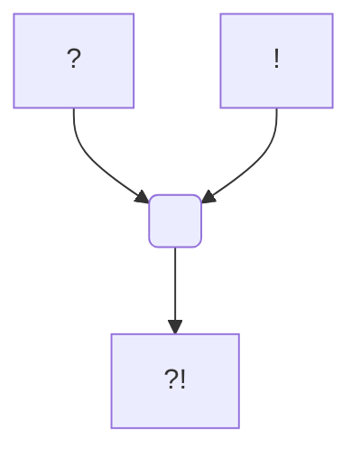

---
tags:
  - Personnage/Mortel
  - Compagnie-Douze
---
# Vritra

## Informations personnelles
### Nom Complet
### Pronoms
### Titres
### Alias
### Type de créature
### Race
### Classe %%(le cas échéant)%%
### Alignement
### Statut
Décédé
### Naissance
### Décès
### Résidence
Gorge d'un dragon noir (anciennement)
### Occupation

## Histoire

## Description
### Apparence

### Personnalité

## Capacités

## Relations
### Famille
### Relations amoureuses
### Amis
### Alliés et Affiliations
[[Compagnie Douze]] 
### Ennemis
### Autres relations

## Arbre Généalogique

## Citations

## Galerie

Portrait de Vritra
![[Vritra-portrait.png]]
Token de Vritra
![[Vritra-Token.png]]
## Anecdotes