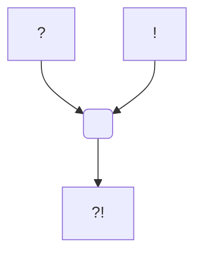

---
tags:
  - Personnage/Mortel
  - CompagnieDuChaos
---
# Mordecai Noname

## Apparence

## Informations personnelles
### Nom Complet
Mordecai Noname

### Pronoms
### Titres
### Alias
### Type de créature
### Race
### Classe %%(le cas échéant)%%
### Alignement
### Statut
### Naissance
### Décès
### Résidence
### Occupations

## Histoire

## Description
### Apparence

### Personnalité

## Capacités

## Relations
### Famille
[[Mog'dral]] (Grand-père)

### Relations amoureuses
### Amis
### Alliés et Affiliations
[[Église du Crépuscule]] (Anciennement, ex-communié)

### Ennemis
### Autres relations

## Arbre Généalogique

## Citations

## Galerie
![[z_Ressources/Attachements/PC/Une Angélique Errance/Mordecai/Token.png]]

## Anecdotes