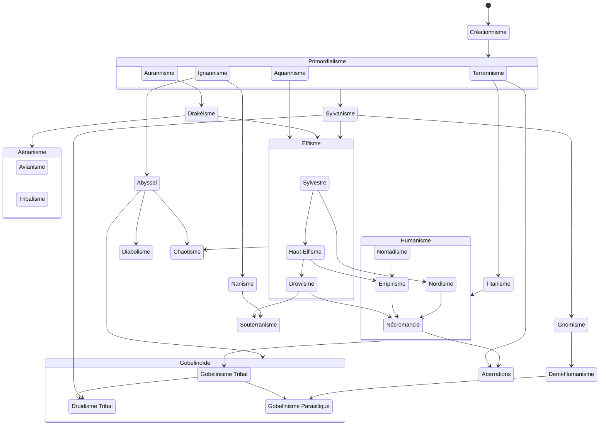

---
tags:
  - Lore/Culture
---
## Évolution des cultures

```mermaid
stateDiagram-v2
    Divin: Créationnisme
	state "Primordialisme" as Élémentaire
	state Élémentaire {
		Terran: Terrannisme
		Auran: Aurannisme
		Aquan: Aquannisme
		Ignan: Ignannisme
	}
	state "Aérianisme" as Aérien
	state Aérien {
        Direction LR
		Aarakocra: Avianisme
		Goliath: Tribalisme
	}
	state "Elfisme" as Elfe
	state Elfe {
		Sylvestre: Sylvestre
		HautElfe: Haut-Elfisme
		Drow: Drowisme
	}
	state "Humanisme" as Humain
	state Humain {
		Nécromancie: Nécromancie
		Manasie: Nomadisme
		Whitford: Nordisme
		Kinford: Empirisme
	}
    State Gobelinoïde {
        Gobelours: Druidisme Tribal
	    Gobelin: Gobelinisme Parasitique
	    Hobgobelin: Gobelinisme Tribal
    }
	Sylvain: Sylvanisme
	Dragon: Drakéisme
	Géant: Titanisme
	Démon : Abyssal
	Diable: Diabolisme
	Gnome: Gnomisme
	Halfelin: Demi-Humanisme
	Nain: Nanisme
	Orc: Chaotisme
	Souterrain: Souterranisme
	Aberration: Aberrations
	

	[*] --> Divin
	Divin --> Élémentaire
	
	Auran --> Dragon
	Ignan --> Démon
	Ignan --> Nain
	Aquan --> Elfe
	Terran --> Aberration
	Terran --> Géant
    Élémentaire --> Sylvain

	Géant --> Humain

	Dragon --> Aérien
	Dragon --> Elfe
	
	Démon --> Diable
	Démon --> Orc
	Démon --> Gobelinoïde
	Humain --> Hobgobelin
	Hobgobelin --> Gobelin
	Hobgobelin --> Gobelours

	Sylvain --> Elfe
	Sylvain --> Gobelours
	Sylvain --> Gnome

    Elfe --> Orc
	Gnome --> Halfelin
	Halfelin --> Gobelin
	
	Sylvestre --> Whitford
	Sylvestre --> HautElfe
	HautElfe --> Kinford
	HautElfe --> Drow
	Drow --> Nécromancie
	Drow --> Souterrain
    Nain --> Souterrain

	Manasie --> Kinford
	Kinford --> Nécromancie
	Whitford --> Nécromancie
	Nécromancie --> Aberration
```
