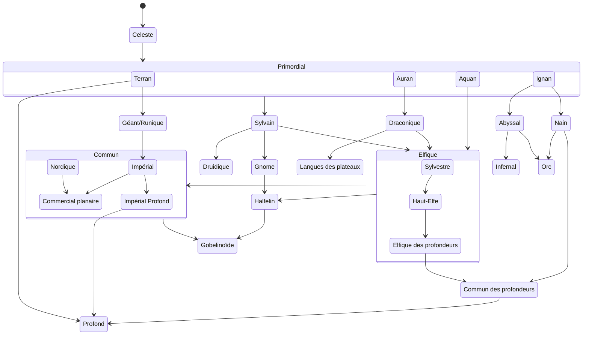

---
tags:
  - Lore
  - Notes
---
## Évolutions

## Équivalences
### Humain
#### Commun
Commercial planaire — Français
#### Dialectes
Impérial — Espagnol
Nordique — Roumain
Impérial profond — Catalan

### Famille du Géants
Géant — Hébreu
Nain — Arabe
Nain des collines — Matais
Gobelinoïde — Amharique
Duergar — Haoussa

### Famille du Sylvain
Draconique — Chinois (Traditionnel)
Sylvain — Persan
Unseelie/Outremonde — Pachtô

#### Elfique
Elfique — Anglais
Haut-Elfique — Irlandais
Sylvestre —  Gaélique (Écosse)
Drow — Gallois

#### Dérivés elfiques
Orc — Kurde (Kurmanji)
Yuan-Ti — Japonais
Halfling — Suédois

#### Gnome
Gnome — Polonais
Gnome des Forêts — Ukrainien
Gnome des Rochers — Polonais
Svirfneblin — Biélorusse

### Famille de l'Infernal
Infernale — Telugu
Abyssal — Tamoul
Gnoll — Kannada

### Famille du primordial
Primordial — Javanais
Aquan — Hawaiian
Auran — Indonésien
Ignan — Sundanese
Terran — Filipino

### Autres
Profond — Espéranto
Commun des profondeurs — LSF/Russe
Celeste — Grec