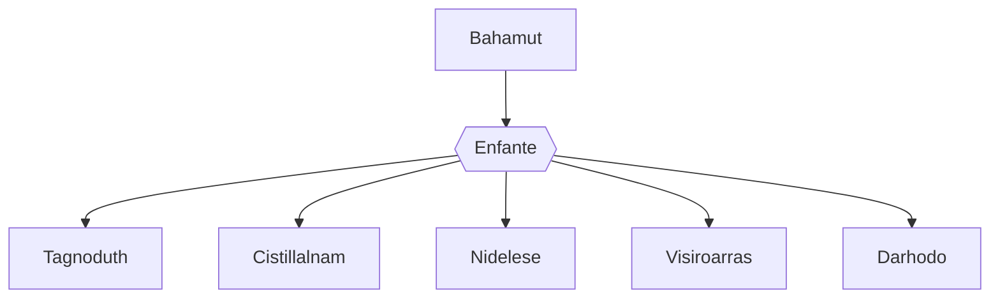

---
tags:
  - Personnage/Dragon
  - Personnage/Divinité/Panthéon-Draconique
---
## Informations personnelles
### Nom Complet
Bahamut
### Pronoms
Il/Lui
### Titres
### Alias
### Type de créature
[[Espèces#Dragons|Dragon]]
### Race
Dragon de Platine
### Classe %%(le cas échéant)%%
### Alignement
### Statut
### Naissance
### Décès
### Résidence
### Occupation

## Histoire

## Description
### Apparence

### Personnalité

## Capacités

## Relations
### Famille
Les dragons métalliques (enfants) :
	- [[Tagnoduth]], le dragon d'or
	- [[Cistillalnam]], le dragon d'argent
	- [[Nidelese]], le dragon d'airain
	- [[Visiroarras]], le dragon de bronze
	- [[Darhodo]], le dragon de cuivre

### Relations amoureuses
### Amis
### Alliés et Affiliations
### Foi
### Ennemis
### Autres relations

## Arbre Généalogique

## Citations

## Galerie

## Anecdotes