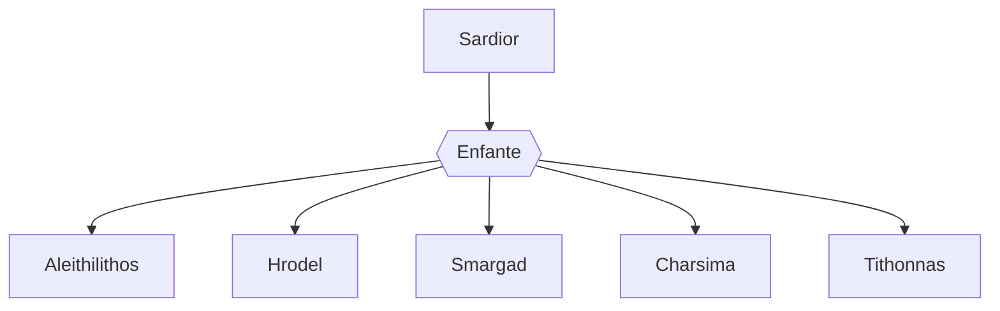

---
tags:
  - Personnage/Dragon
  - Personnage/Divinité/Panthéon-Draconique
---
## Informations personnelles
### Nom Complet
Sardior
### Pronoms
Iel/Elui
### Titres
### Alias
### Type de créature
[[Espèces#Dragons|Dragon]]
### Race
Dragon de Rubis
### Classe %%(le cas échéant)%%
### Alignement
### Statut
### Naissance
### Décès
### Résidence
### Occupation

## Histoire

## Description
### Apparence

### Personnalité

## Capacités

## Relations
### Famille
Les dragons de gemmes (enfants) :
	- [[Aleithilithos]], le [dragon d'améthyste](https://www.dndbeyond.com/sources/ftod/bestiary#AmethystDragons)
	- [[Hrodel]], le [dragon de cristal](https://www.dndbeyond.com/sources/ftod/bestiary#CrystalDragons)
	- [[Smargad]], le [dragon d'émeraude](https://www.dndbeyond.com/sources/ftod/bestiary-ek#EmeraldDragons)
	- [[Charsima]], le [dragon de saphir](https://www.dndbeyond.com/sources/ftod/bestiary-lz#SapphireDragons)
	- [[Tithonnas]], le [dragon de topaze](https://www.dndbeyond.com/sources/ftod/bestiary-lz#TopazDragons)

### Relations amoureuses
### Amis
### Alliés et Affiliations
### Foi
### Ennemis
### Autres relations

## Arbre Généalogique

## Citations

## Galerie

## Anecdotes