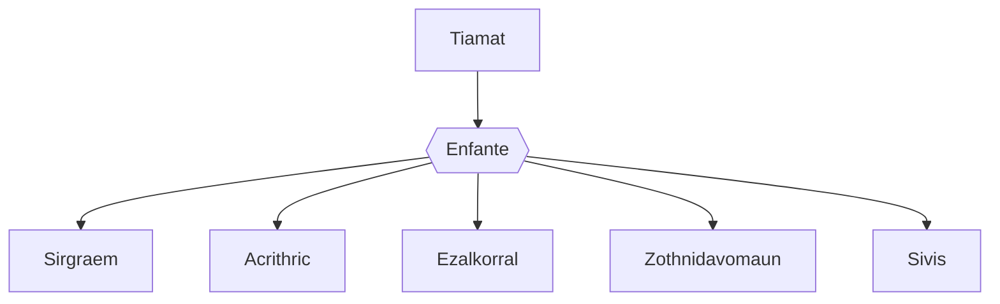

---
tags:
  - Personnage/Dragon
  - Personnage/Divinité/Panthéon-Draconique
  - Personnage/Divinité/Dieux-Traitres
---
## Informations personnelles
### Nom Complet
Tiamat
### Pronoms
Elle/Elle
### Titres
### Alias
### Type de créature
[[Dragons|Dragon]]
### Race
Dragon Chromatique
### Classe %%(le cas échéant)%%
### Alignement
### Statut
### Naissance
### Décès
### Résidence
### Occupation

## Histoire

## Description
### Apparence

### Personnalité

## Capacités

## Relations
### Famille
Les dragons chromatiques (enfants) :
	- [[Sirgraem]], le dragon rouge
	- [[Acrithric]], le dragon blanc
	- [[Ezalkorral]], le dragon bleu
	- [[Zothnidavomaun]], le dragon noir
	- [[Sivis]], le dragon vert

### Relations amoureuses
### Amis
### Alliés et Affiliations
### Foi
### Ennemis
### Autres relations

## Arbre Généalogique

## Citations

## Galerie

## Anecdotes