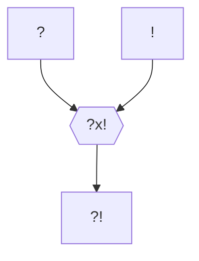

---
tags:
  - Personnage/Mortel
---

## Informations personnelles
### Nom Complet
Brique
### Pronoms
### Titres
### Alias
### Type de créature
Humanoïde
### Race
Orc
### Classe %%(le cas échéant)%%
### Alignement
### Statut
### Naissance
### Décès
### Résidence
### Occupation
Psychologue

## Histoire
Dans la tribu de Brique, les orcs reçoivent leur nom à travers une épreuve de force. Son nom est donc Brique, car la chose la plus dure qu'il ait cassé des ses mains nues est une brique.

Par vocation, Brique est psychologue. Son ultime ambition est qu'un jour, ses thérapies soient suffisamment efficaces qu'il puisse changer son nom en Dépression.

## Description
### Apparence

### Personnalité

#### Hamartia %%Défaut Fatal%%

#### Ruptures %%Comment rompre avec la personnalité du personnage%%

## Capacités

## Relations
### Famille
### Relations amoureuses
### Amis
### Alliés et Affiliations
### Foi
### Ennemis
### Autres relations

## Arbre Généalogique

## Citations

## Galerie

## Anecdotes