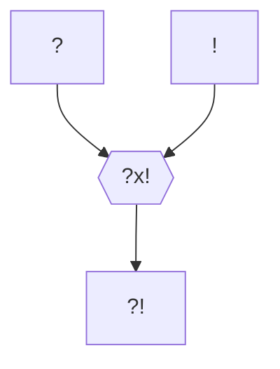

---
tags:
  - Personnage/Mortel
aliases:
  - Camilla
---

## Informations personnelles
### Nom Complet
Camilla Hivro
### Pronoms
Elle/Elle
### Titres
### Alias
### Type de créature
### Race
### Classe %%(le cas échéant)%%
### Alignement
### Statut
### Naissance
### Décès
### Résidence
### Occupation

## Histoire
Camilla naquit d'une noble lignée de sorciers aussi puissants que leur ascendance remontait loin, jusqu'au premier empereur lui-même, et dès sa naissance cet ascendant se manifesta. Il était clair pour tout un chacun que ses pouvoir étaient, et serait d'autant plus, des plus puissants.
Camilla devint extrêmement proche de sa grand-mère, malgré qu'elle ne puisse jamais la voir. En effet, cette dernière souffrait supposément d'une très mauvaise santé qui l'empêchait de côtoyer les vivants. Elles ne pouvaient ainsi parler qu'au travers d'une tenture, mais sa grand-mère était certaine que ses capacités pouvaient être cultivées pour grandir et faire d'elle une utilisatrice de magie encore plus puissante.

La [[Hiérarche|Matriarche]] supervisa elle-même son entraînement, et les deux femmes formèrent un fort lien.
Sous sa tutelle, Camilla devint une sorcière aux pouvoirs incommensurables, jusqu'à ce qu'un soir elle soit réveillée au milieu de la nuit par les membres de sa famille, qui lui annoncèrent que sa grand-mère était mortellement malade et que venait le temps de lui faire ses adieux.

Sanglotant, Camilla entra dans la chambre de sa grand-mère, prête à enfin la voir et lui faire ses adieux. Mais derrière la tenture attendait était moins qu'un corps, mais n'était pas mort... La grand-mère de Camilla était simplement une doublure, celle d'un [[Vairae|Patriarche]] en fin de vie. Camilla avait été sélectionnée depuis sa naissance pour devenir sa nouvelle héritière. Son nouveau corps.

Camilla fuit difficilement sa maison natale cette nuit là. Refaisant sa vie dans une ville étrangère, elle était toujours poursuivie par sa famille, et bien que l'influence de son ancêtre ne soit pas aussi puissante en elle qu'en ses proches, elle le sent... le [[Hiérarche|Patriarche]] approche, leur lien la pousse à vouloir être attrapée, à s'attacher à un endroit jusqu'à être retrouvée.
Whitford est sa dernière cachette. Elle y a des amis. Mais elle l'a récemment revu. Il est tout prêt, et il est probablement déjà trop tard.

## Description
### Apparence

### Personnalité

#### Hamartia %%Défaut Fatal%%
Trust issues

#### Ruptures %%Comment rompre avec la personnalité du personnage%%
Personnage heureux -> Ugly crying

## Capacités

## Relations
### Famille
### Relations amoureuses
### Amis
### Alliés et Affiliations
### Foi
### Ennemis
### Autres relations

## Arbre Généalogique

## Citations

## Galerie

## Anecdotes