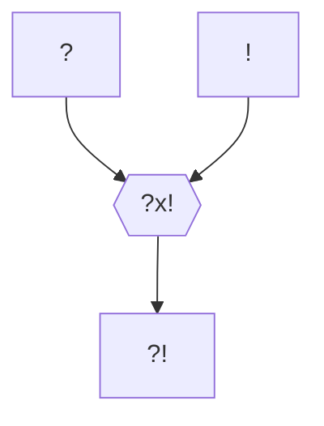

---
tags:
  - Personnage/Mortel
  - Compagnie-Douze
---
%% Rival de Melffy %%
## Informations personnelles
### Nom Complet
Uzad Carl Magnus Idolstadh
### Pronoms
Il/Lui
### Titres
### Alias
Le Rouge, surnom de brigand
Karmush, surnom d'enfance
### Type de créature
[[Goblinoïdes|Goblinoïde]]
### Race
Hobgoblin
### Classe
Barbare, Sentier de la Magie Sauvage
### Alignement
Chaotic neutre
### Statut
Vivant
### Naissance
8 Closeporte 864 KE (35 ans, +1 ans dans la tour des mages)
%%### Décès
Non arrivé%%
### Résidence
Nomade
### Occupation
Brigand,
Noble (anciennement)

## Histoire
Uzad est né dans une riche famille de marchands des [[Tribus Manasiéennes]]. Plus exactement, Uzad naquit de la plus riche et importante famille de marchands du monde désertique, la [[Famille Idolstadh|famille Idolstadh]].
Ils étaient de plus connus pour produire des utilisateurs de magie incroyablement puissants, capables de lancer de façon innée des sorts d'une complexité impossible.

De même que ses frères et sœurs, Uzad fut aimé et choyé dès sa naissance... jusqu'à ce qu'il devienne évident qu'il n'était nullement à l'image des son adelphie, ou même de l'entièreté de sa famille : il semblait ne posséder absolument aucune aptitude magique, et ne pouvait pas lancer le moindre sort. Même les tours de passe-passe que ses adelphes maîtrisaient avant même de savoir lire étaient hors de sa portée.
Dès qu'il devint clair qu'Uzad ne continuerait pas la fière tradition magique de la famille, tout changea. Ses parents, qui attendaient le monde de lui, n'en attendaient désormais plus rien. Quant à ses adelphes, leurs sentiments de pitié se muèrent en un sombre mépris. Qu'importe le mal qu'il se donnait pour leur donner tort, personne ne pensait qu'il pouvait réaliser la moindre chose chose d'importance.

Personne, sinon la maîtresse d'écurie familial. Elle tendit au jeune hobgoblin une épée de bois et le mit au travail. Uzad accepta son offre immédiatement.
Toujours optimiste et ayant à cœur de faire ses preuves, il endura un entraînement intense, tant physique qu'intellectuel, poussant son corps et son esprit dans leurs limites les plus lointaines, et au-delà, sans jamais se départir de son sourire.
Il avait à cœur de prouver à sa famille qu'il était bon à quelque chose, et il devint, à l'âge de 20 ans, un jeune bretteur incroyablement talentueux dans les arts martiaux, capable de venir à bout d'opposants doublement plus grand et plus âgés.
La maîtresse d'écurie lui avait enseigné la valeur du dévouement et l'importance de la persévérance, et il appliquait les mêmes enseignements pour ses études académiques. Musique, protocoles, classes… tout était bon pour impressionner sa famille.

Mais ce n'était jamais assez. Rien ne pouvait palier le fait qu'il était incapable de manier la magie. Uzad continuait d'essayer, et gardait en façade son caractère vif et enthousiaste. Mais sa colère ainsi que son impuissance face à la perpétuelle déception de sa famillle grandirent encore et toujours au fond de lui. Il garda cette rage enfermée au fond de lui et continua de s'entraîner avec la maîtresse d'écurie avec un large sourire sur le visage.

Jusqu'au jour où, durant un simulacre de combat contre son entraîneuse, son grand frère usa d'un simple sort pour le faire trébucher et l'humilier. Alors que celui-ci riait, Uzad sentit la rage enfermée au fond de lui bouillir, débordant du plus profond de son être et inondant son esprit, s'exprimant en une puissante rage aveugle. Et avec cette rage, quelque chose d'autre l'enveloppa. De la magie.
En effet, quelques-unes des aptitudes magiques coulant dans les veines de sa famille coulait aussi dans les siennes depuis tout ce temps. Leur accès était simplement extrêmement difficile, tout comme l'était leur contrôle. Il n'était capable de rassembler cette magie qu'empli de rage, et ne pouvait en rien choisir comment celle-ci se manifestait au cœur de sa rage.

Voyant cela, Uzad et sa maîtresse se mirent au travail pour lui permettre de contrôler sa rage, ainsi que sa magie. Des années après avoir exprimé son potentiel pour la première fois, Uzad décida de quitter la maîtresse d'écurie, fort de ses capacités, pour entreprendre sa revanche sur sa famille.
Il mettrait en déroute l'entreprise familiale afin de les faire descendre un par un de leur tour d'ivoire, lui permettant de défier chacun des membres de sa famille en combat, leur magie contre la sienne. Si la magie était la seul chose à laquelle ils accordaient de la valeur, il leur prouverait qu'il mérite l'amour et le respect qu'ils lui refusaient, en les humiliant avec les pouvoirs qu'ils jugeaient trop insuffisants pour être considérés.

Il se constitua dans son entreprise une seconde famille. Des gobelins, pour la plupart, libérés de la [[Goblinoïdes#La malédiction de Vargas|malédiction de Vargas]], qui lui apportaient autant de respect et d'amour qu'une famille criminel pouvait le faire. Ce n'était certes que peu, mais c'était déjà bien plus que ce dont il avait joui durant ses primes années.
Attaquant des caravanes, pillant des entrepôts, dévalisant des convois, ils faisaient régner la terreur dans les alentours. Ses crimes, tous dirigés vers les activités de sa famille, leur valurent bientôt les *considérations* des milices locales, et bientôt des chasseurs de primes conventionnels. Mais rien n'y faisait, tous ne faisaient que s'écraser contre le mur qu'était Uzad, une fois lancé contre son ennemi.
Cela dura. Et dura. De longues années. Puis une décennie. Cela dura jusqu'à ce qu'Uzad et sa nouvelle famille ne réalisent leur plus gros coup : la capture du convoi d'eau en direction de la capitale des [[Tribus Manasiéennes]], [[Ynathyrwi]]. La [[Famille Idolstadh]] réagit aussi tôt, faisant appel à la [[Guilde des Mercenaires]] pour régler cette affaire.
Éliminant d'abord les lieutenants et les plus jeunes membres de l'organisation, c'est lors d'un raid punitif que les derniers membres de la nouvelle famille d'Uzad périrent aux mains des [[Compagnie Douze|Tessombres]].

Jurant de se venger d'eux et de sa famille, Uzad entreprend aujourd'hui de réunir suffisamment de ressources pour ramener sa nouvelle famille à la vie, espérant pouvoir un jour se retirer sans regrets, loin de ce désert qui ne lui avait causé que souffrances et désespoir.

En outre, l'incident impliquant la [[Compagnie Douze|compagnie de mercenaires Douze]] fit ressurgir en lui une rémanence de la [[Goblinoïdes#La malédiction de Vargas|malédiction de Vargas]], alimentant une propension nouvelle pour la violence et la mort. Bien qu'aujourd'hui sous contrôle, sa soif de sang reste difficilement sous contrôle, et le moindre accident pourrait vite prendre une tournure plus... Dramatique.

## Description
### Apparence

### Personnalité

## Capacités

## Relations
### Famille
### Relations amoureuses
### Amis
### Alliés et Affiliations
### Foi
### Ennemis
### Autres relations

## Arbre Généalogique

## Citations
"Les mages ont la connaissance. Les sorciers, le pouvoir. Les soldats, le courage. Les croyants, leur foi. Et les poètes, du cœur. Mais moi… Tout ce que j’ai, c’est la rage."

"Uzad ! Il est temps que tu répondes de tes actes !
\- Je ne vois pas de quoi vous parlez ! Ne suis-je pas qu'un fermier qui ne ferait pas de mal à une mouche ? Allons, que puis-je faire pour vous ?
\- Ça ne marche pas comme ça, Uzad, je sais qui tu es !
\- Et alors, hm ? Que veux-tu que je fasse ? Que je fasse tomber le masque et que je redevienne celui que j'étais ? C'est ce que tu voulais, n'est-ce pas ? L'ancien moi. Impérial. Purgeant quiconque je juge inférieur. Tu aimes bien les Manasiéens, hein ? Je les écraserai.
\- Uzad ! Arrête !
\- Oh, si tu veux m'arrêter il faudra me tuer...
\- Tu sais que je devais le faire pour t'arr... !
\- Exactement ! Tu ! M'as ! Arrêté ! N'oublie pas que tu es celle qui m'a mis ce masque sur le visage ! Et te voilà, devant moi, à me juger ? Ha ha, ne me fais pas rire. Pourquoi on ne fait pas ça, je vais remettre mon masque et tu vas garder le tiens, et on va revenir à cette mascarade que tu as instillée. Et donc, je te le demande, encore une fois... Que puis-je faire pour toi ?"

"J'aimerais bien être heureux, même si je ne sais pas ce que ça veut dire… J'en ai marre d'être malheureux."

"Je n'aime pas ça… Je ne supporte pas d'être capable d'entendre un homme hurler de douleur sans prendre le temps de me demander si j'ai raison. De savoir que pour être aussi bon que ça, je dois m'aliéner inhumainement. Je ne veux pas devenir comme ça."

## Galerie

## Anecdotes