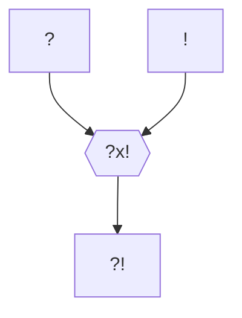

---
aliases:
  - Mallun Hivro
  - Mallun Quinn Kinford
  - Mallun Kinford
  - Kinford Ier
  - Vairae
  - Agnamar Claire-Lame
  - Camilla
  - Camilla Hivro
tags:
  - Personnage/Immortel
---
> [!infobox]
> # Vairae
> ![[Image.png|cover hsmall]]
> 
> |||
> | ---- | ---- |
> | Type | PNJ |
> | Player | Jules (MJ) |
> ###### Informations personnelles
> |||
> | ---- | ---- |
> | Nom complet | ? |
> | Pronoms | ? |
> | Alias | L'Immortel Le Premier Empereur Kinford Ier Mallun Quinn Kinford, née Hivro L'Impératrice Sanglante |
> | Lignée | ? |
> | Titres | Haut-Mage Empereur Éternel de l'Empire Kinford |
> | Type de créature | Mort-Vivant |
> | Espèce | [[Liche]] (Haut-Elfe, en tant que Vairae) [[Hiérarche]] (humain, Camilla Hivro, Kinford Ier et ses anciens vaisseaux) [[Parjure]] (Centaure, Eclipse) [[Marche Funèbre]] (Humain, Agnamar Claire-Lame) [[Entonneur]] (Gnome, compositeur de La Whitfordienne) [[Nécromate]] (Kinford Ier) [[Fléau]] [[Calamité]] [[Charogne chasseresse]] [[Âme Incarnée]] (Gobelin, [[Erd, du clan des Disciples Rejetés]]) |
> | Occupation | ? |
> | Résidence | [Branches d'Éternité](https://www.dndbeyond.com/sources/dnd/wel/boughs-of-eternity) (Vairae) Donjon de Whitford (Agnamar Claire-Lame) |
> | Classe | ? |
> | Alignement | ? |
> ###### Statut
> |||
> | ---- | ---- |
> | Statut | Mort-Vivant / Simili-Glitch |
> | Date de naissance | Aube des temps (Vairae) -28 KE (Kinford Ier) |
> | Lieu de naissance | ? |
> | Date de mort | ? |

## Description
### Apparence

### Personnalité

#### Hamartia %%Défaut Fatal%%

#### Ruptures %%Comment rompre avec la personnalité du personnage%%

## Histoire

### Premier Âge
Vairae (veh-RYE) est issue d'une longue lignée de mages elfes de Gael Wode. Iel excellait à l'école et se faisait facilement des amis—ce qui signifiait que personne ne le contestait lorsqu'iel malmenait les enfants les plus faibles.

À l'âge adulte, Vairae rejoignit la garnison de Gael en tant que mage de bataille pour compléter ses compétences. Une fois de plus, iel s'acquitta admirablement de sa tâche et fut couvert d'admirateurs et de promotions. Mais après avoir découvert un tome énigmatique sur le cadavre d'un mage ennemi, Vairae se mit à viser encore plus haut : le tome contenait un rituel permettant de conserver à jamais sa vigueur et sa puissance. Après avoir passé de nombreuses nuits à déchiffrer le texte, Vairae a succombé à l'irrésistible attrait de ce rituel… et a sacrifié son meilleur ami dans le processus.

Son cœur désormais scellé dans une sphère de glace éternelle, Vairae retourna à Gael Wode sous un déguisement et s'éleva ambitieusement au rang de Haut Mage. Aujourd'hui, Vairae, vieux de plusieurs siècles, est toujours aussi svelte et bellaux, avec de fidèles disciples à ses ordres. Mais le monde à l'extérieur du Wode était vaste et n'appartenait pas encore à Vairae.

Curieux d'approfondir ses connaissances, Vairae enseigna en secret, en échange du secret de la Magie Runique Naine, celui de la Magie Druidique Elfique. Iel se rapprocha ainsi peu à peu du monde humain, prenant de nombreux apprentis à travers les siècles.
Malheureusement, le pouvoir auquel aspiraient les Hommes auxquels il enseignait en corrompait plus d'un, et c'est au détour des expérimentations de l'un de ses apprentis qu'iel fit la connaissance de l'être le plus particulier de la création : une créature aux mille et un visages à travers les âges. 

Ami de [[Zelthsirka Delorme]], iel assista à la mort de sa bien-aimée et l'aida dans son deuil de [[Maryola Delorme]]. Iel promit alors de faire pénitence et de la venger de son apprenti [[Mog'dral|Os'qog]]. Celui-ci devenu [[Mog'dral]], Vairae promet d'abattre les nouveaux dieux après [[La Chute des Primordiaux]].
Cette promesse n'était cependant pas désintéressée. En effet, loin d'être le premier de ses élèves à le trahir, [[Mog'dral]] s'était finalement, quelque peu contre son gré, allié à celle de ses apprentis qui deviendrait sa plus grande rivale : [[Thaena]].
### Deuxième Âge
Soucieux de tenir sa promesse à la seule autre immortelle qu'iel connaisse, Vairae s'engagea en opposition à Sardior dans les différents conflits de cet âge. Là où le dragon prismatique tentait à tout prix de limiter les dégâts lors des combats, tant entre ses adelphes dragons que les suivants de leurs créateurs, le Haut Mage exterminait les belligérant, indépendamment de leur affiliation.
### Troisième Âge
#### Le Vol de la Magie
-12 KE, Vairae enseigne les secrets de la magie à un jeune humain qu'il place sous sa coupe—via un rituel de scission de l'âme—: Kinford Ier.
Kinford Ier crée l'[[Les Mages|ordre des Mages]].

Le futur empereur devient alors une extension de la volonté de la Liche, qui se retire pour vivre à travers lui, glissant peu à peu dans un profond sommeil au sein des [Branches d'Éternité](https://www.dndbeyond.com/sources/dnd/wel/boughs-of-eternity).

#### Kinford Ier
##### La naissance d'un Empire
[[L'Expansion de l'Empire Kinfordien]]

Durant son expansion, son général le plus loyal, dont la loyauté datait déjà du Deuxième Âge, [[Eclipse]], eu l'honneur de devenir le premier hôte d'un fragment de l'âme de l'Empereur Éternel, devenant le premier [[Parjure]] à ce jour en compagnie de [[Zelthsirka Delorme]], dont il partage le vœu, dans leur quête de Déicide.
##### Les racines du mal
Établissement des académies de magie humaines et de la [[Tour des Mages]].

Développement, au sommet, de la gravitomancie et de la chronomancie, futures graviturgie et chronurgie, ainsi que tenue d’expérimentations sur la nature de la magie, théorie aboutie des siècles plus tard par [[Iksana Vinaya]].
Conséquences :
* Expérimentations sur la magie du corps, résultant en la naissance des Moine de la Voie de la Chair.
* Expérimentations sur les vampires et les lycanthropes, résultant en la naissance des premier Blood Hunters.
* Experimentations sur les sources de magie et le cycle énergétique, résultant en l’émergence des rites nécrotiques de lichification, au-delà des simples rituels de nécromancie réalisés par les magiciens.
	* Rituel nécromancien > [[Liche]]
	* Magie du sang > [[Hiérarche]], fuita parmi les criminels pour donner les Voleurs de Sang
	* Magie des arts > [[Entonneur]]
	* Magie druidique > [[Fléau]]
	* Ingénierie magique > Percées menant au concept des augmentés > [[Nécromate]]
	* Rage des barbares > [[Calamité]]
	* Magie naturelle > [[Charogne chasseresse]]
	* Arts Martiaux > Magie de Conscription > [[Marche Funèbre]]
	* Magie des serments > [[Parjure]]
	* Magie de l'âme > [[Âme Incarnée]]

C'est la seconde que l'empereur, déjà infusé de ses pouvoirs volés, utilisa pour assurer son immortalité, à travers son sang. Il se désintéressa alors de la magie, car il avait trouvé en elle tout ce qu'elle pouvait lui apporter.

##### La mort d'un Empereur
Étendant sa lignée aux quatre coins du continent par le biais de bâtards et d'enfants illégitimes, c'est dans la lignée impériale, engendrée par son mariage avec la fille du Haut-Roi Nordique, que le sang était le plus puissant. La pureté du sang fut conservée notamment grâce aux mariages entre demi-frères et demi-sœurs. Laissant peu à peu sa place d'empereur à ses descendants, qu'il contrôlait toujours via son sang, il pris le contrôle de son arrière-arrière-arrière-petit-fils Scarrow Kinford, alors futur Kinford VII à la suite de l'assassinat de son père, lui-même frère de Kinford V, puis fit secrètement enterrer son corps dans un caveau sobre, dans les souterrains de [[Whitford]], en 295 KE.

Le fils de Scarrow fut cependant témoin des agissements de son ancêtre et, profitant du rituel de transfert, fomenta un plan pour faire cesser ce complot nécrotique : il cacha son propre fils à la vue du [[Hiérarche]], afin que celui-ci les venge, auprès de l'archimage de [[Cragwell]], pour profiter des bienfaits du dernier étage de la [[Tour des Mages]], où sa descendance ferait—officiellement—office de "cobayes" pour des expérimentations de chronurgie, se transmettant de génération en génération un artefact, une pierre astrale renfermant un nexus de magie, qui permettait à son porteur de vieillir dans cet endroit où le temps n'avait pas d'emprise. Les générations s'y succédèrent ainsi durant 400 ans, diluant suffisamment leur sang pour échapper au contrôle du mort-vivant.

Entretemps, Kinford Ier passa par un autre vaisseau.

C'est des siècles plus tard que le descendant du premier roi se fit connaître, un unique fils, qui prendrait le nom d'Agnamar Claire-Lame. Celui-ci mena la [[Révolution Whitfordienne]], jusqu'à sa disparition, capturé sur le champs de bataille par son ancêtre, non sans détruire le corps de Scarrow Kinford. L'Empereur Éternel remplaça son corps abîmé par celui de son héritière, Mallun Hivro.

C'est après avoir récupéré un corps convenable que Kinford réalisa, pour la seconde fois, une séparation de son âme, à l'insu—à l'origine tout du moins—d'Agnamar.

### Mallun Quinn Kinford
Née Hivro, Mallun était une sorcière très puissante, fille de noble famille. Elle servit de 3ème réceptacle à son ancêtre, Kinford Ier.
Seconde épouse de [[Kinford XVIII]] et mère de [[Kinford XIX]].

[[Hiérarche]] s'étant fait passer pour une jeune femme afin d'épouser l'empereur dont la première épouse avait—assez peu—mystérieusement été empoisonnée des années auparavant et ainsi prendre le pouvoir à sa mort, qu'elle précipita lors du [[Régicide de Kinford le 18ème]].

Sa conduite de l'Empire, notamment en matière d'intégration culturelle, mena rapidement au mécontentement des populations colonisées des siècles auparavant, dont les empereurs précédents avaient convenu de conserver les cultures diverse.
Parmi ces populations se trouvaient les nordiques du [[Royaume Whitfordien]], principale menace pour l'empire de par leurs avantages tactiques en cas de soulèvement.

Elle prit donc la décision de cristalliser cette colère. 3 ans après son régicide, elle relança, sous l'identité du Haut-Roi qu'elle contrôlait, la [[Révolution Whitfordienne]], créant au passage la [[Marche Funèbre]] associée à cet acteur.
Elle continua de mener la vie dure à son fils, puis à sa petite-fille, [[Kinford XX]], qui mit fin au conflit en stoppant l'avancée des troupes mort-vivantes en l'an 836, en scellant au prix de sa propre vie l'âme de la [[Hiérarche]] dans son corps originel : celui de Kinford Ier, momifié et inhumé sous [[Whitford]].
La [[Marche Funèbre]], vaincue en 862 KE, se cacha plus d'un siècle et demi durant, attendant patiemment [[#Le retour de l'Empereur]].

### Le retour de l'Empereur
Le [[Hiérarche]] découvrit alors l'horreur de la cité. Pris entre deux hydres, elle s'échappa une première fois, revenant auprès de la famille de son dernier vaisseau. Il se cacha durant 40 ans, dans une peinture de la salle du trône, représentant le Haut-Roi revenant de la chasse, sous les traits d'un moine lui lavant les pieds, cachant le lièvre qu'il tenait en main, avant qu'une héritière digne de ce nom et capable de l'accueillir ne naisse, [[Camilla Hivro]].

Il fit transporter son tableau dans la chambre de la grand-mère de celle-ci, le soir de son 18ème anniversaire, en sortit et prépara le rituel, avant que sa vue ne provoque la fuite in-extremis de la jeune fille.

Quatre ans de traque s'en furent, avant qu'elle ne soit finalement repérée à [[Whitford]]. Le [[Hiérarche|Patriarche]] revint donc dans son tableau et se fit transporter de retour. Mais tout ne se déroula pas comme prévu. La sorcière qui devait le libérer fut dévorée par la fausse hydre, avide de chair fraiche et attirée par la puissance du sorcier, figeant celui-ci pendant plusieurs mois au sein de ce tableau.

Son sort sera décidé durant [[Le Temps des Mensonges]]

### Actuellement
Libéré par le rêve d'une jeune drakéïde orpheline et les Tessombres.

Désintègre [[Epaline Llamiryl]], confie sa chevalière pour la faire ressusciter.
Utilise la chevalière pour se téléporter dans la cathédrale de l'[[Église du Crépuscule]] et capturer [[Camilla Hivro]]. Commence à réaliser le rituel de transfert dans les catacombes mais empêché par Les Tessombres. Kinford ne peut infuser son corps que d'une [[Session 25#Formule Mineure|incantation mineure]].

Les Tessombres ayant fui, tente de les atteindre en téléportant Agnamar au sein de la tour des mages. Celui-ci retourne [[Eclipse]], son ancien général, contre ses compagnons.

Durant le mois d'entraînement des Tessombres, Kinford Ier se met à l'œuvre.
Agnamar Claire-Lame est mobilisé pour lancer l'assaut sur l'Empire Kinfordien avec sa [[Marche Funèbre]].
Eclipse, maintenant réintégré aux rangs des [[Parjure]], commence à reformer l'ordre et, les forces impériales occupées au nord, lance une attaque visant à capturé [[Camilla Hivro]] aux mains de l'[[Église du Crépuscule]].

Kinford Ier commence à réaliser le rituel pour transférer son essence en Camilla.

Au nord, les Tessombres ont fait couler le sang au-dessus des ruines de Gael Wode.
Vairae est réveillé par l'offrande des âmes sur ces terres.

Vairae découvre que le rituel de Kinford Ier arrive bientôt à termes, sous les yeux d'Accord qui ne tilte pas.
Kinford Ier transformera ensuite le corps du premier empereur humain en [[Nécromate]].

## Capacités

## Relations
### Famille
### Relations amoureuses
### Amis
### Alliés et Affiliations
### Foi
### Ennemis
### Autres relations

## Anecdotes

## Citations

## Galerie

# Draft

## Description
### Apparence

### Personnalité

#### Hamartia %%Défaut Fatal%%

#### Ruptures %%Comment rompre avec la personnalité du personnage%%

## Capacités

## Relations
### Réceptacle

### Famille
### Relations amoureuses
### Amis
### Alliés et Affiliations
### Foi
### Ennemis
### Autres relations

%%## Arbre Généalogique

%%

## Citations
"L'honneur. Tu adores ce mot, n'est-ce pas, Vardis ? Dis-moi, était-ce l'honneur, quand tu as meurtri des dizaines de mes hommes ? Des hommes essayant juste de se frayer un chemin dans ce monde, des hommes avec des familles. Dis-moi, était-ce l'honneur qui t'a conduit à laisser des centaines de milliers mourir, dans ton aveugle poursuite de ma personne ? Dis-moi, es-tu plus honorable car tu affrontes l'ennemi en face et l'abandonne ensuite, mourant, suppliant, saignant dans la boue ? Non, Vardis. L'honneur n'est pas ton bouclier. C'est ton excuse." - Parlant à [[Eclipse]]

"Tu sais, autrefois, je détestais le sang qui coulait dans mes veines, haïssais mes pouvoirs, les considérais comme une malédiction. Mais maintenant, je les vois pour ce qu'ils sont, non une malédiction, mais un don."

"Vous êtes-vous déjà demandé d’où on vient ? Car je peux vous assurer d’une chose : ce ne sont pas les monstres qui font la guerre… c’est la guerre qui forge le monstre."

"Si le monde est une scène, l’identité n’est rien de plus qu’un costume"

"You can kill me here and now in as many ways as you like, but you cannot kill me in any ways that matters, for I have transcended mere mortality."
## Galerie

## Anecdotes