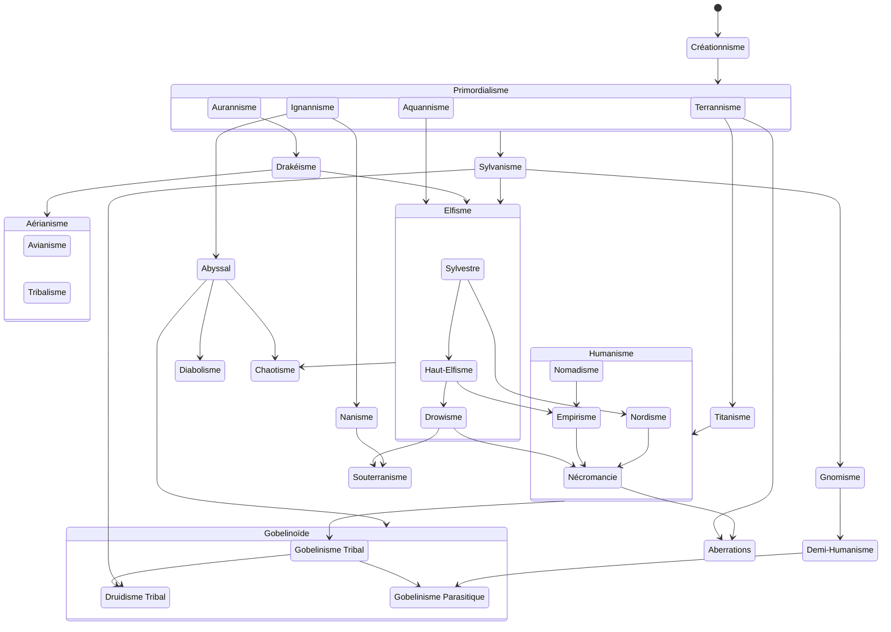
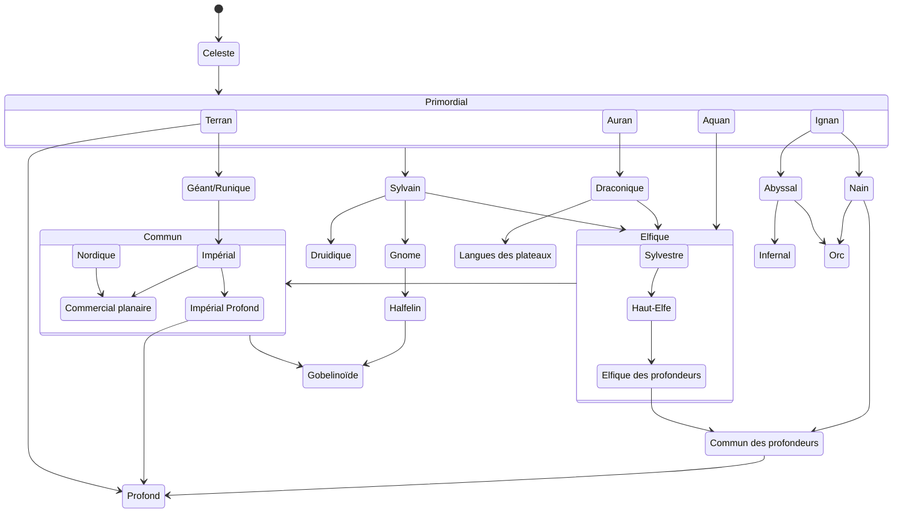

## Évolution des cultures

## Langages
### Évolutions

### Équivalences
#### Humain
##### Commun
Commercial planaire — Français
##### Dialectes
Impérial — Espagnol
Nordique — Roumain
Impérial profond — Catalan

#### Famille du Géants
Géant — Hébreu
Nain — Arabe
Nain des collines — Matais
Gobelinoïde — Amharique
Duergar — Haoussa

#### Famille du Sylvain
Draconique — Chinois (Traditionnel)
Sylvain — Persan
Unseelie/Outremonde — Pachtô

##### Elfique
Elfique — Anglais %%(Urdu+Hindi)%%
Haut-Elfe — Irlandais
Sylvestre —  Gaélique (Écosse)
Drow — Gallois

##### Dérivés elfiques
Orc — Kurde (Kurmanji)
Yuan-Ti — Japonais
Halfling — Suedois

##### Gnome
Gnome — Polonais
Gnome des Forêts — Ukrainien
Gnome des Rochers — Polonais
Svirfneblin — Biélorusse

Commun des profondeurs — LSF/Russe
Celeste — Grec

#### Famille de l'Infernal
Infernale — Telugu
Abyssale — Tamoul
Gnoll — Kannada

#### Famille du primordial
Primordial — Javanais
Aquan — Hawaiian
Auran — Indonesian
Ignan — Sundanese
Terran — Filipino

#### Autres
Profond — Espéranto