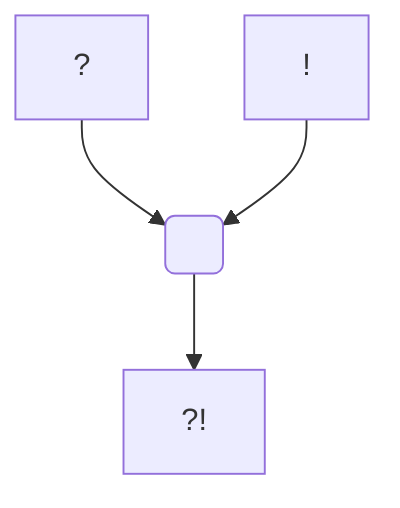

#Personnage/Dragon  [[Dragon]]
#Divinité/Panthéon-Draconique [[Panthéon Draconique]]

## Informations personnelles
### Nom Complet
Sardior
### Pronoms
Iel/Elui
### Titres
### Alias
### Type de créature
[[Espèces#Dragons|Dragon]]
### Race
Dragon de Rubis
### Classe %%(le cas échéant)%%
### Alignement
### Status
### Naissance
### Décès
### Résidence
### Occupation

## Histoire

## Description
### Apparence

### Personnalité

## Capacités

## Relations
### Famille
### Relations amoureuses
### Amis
### Alliés et Affiliations
### Foi
### Ennemis
### Autres relations

## Arbre Généalogique

## Citations

## Galerie

## Anecdotes