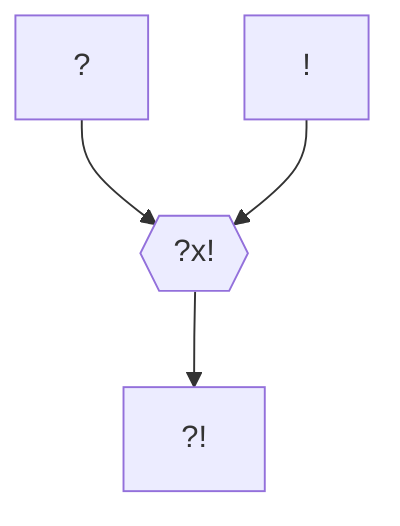

#Personnage/Immortel  [[Immortel]]

## Informations personnelles
### Nom Complet
### Pronoms
### Titres
### Alias
### Type de créature
Mort-Vivant
### Race
Hiérarque (humain)
### Classe %%(le cas échéant)%%
### Alignement
### Statut
### Naissance
-28 KE
%%### Décès%%
### Résidence
### Occupation

## Histoire
### Le Vol de la Magie
-12 KE, crée l'[[Les Mages|ordre des Mages]].

### Kinford Ier
#### La naissance d'un Empire
[[L'expansion de l'Empire Kinfordien]]

#### Les racines du mal
Établissement des académies de magie humaines et de la [[Tour des Mages]].

Développement, au sommet, de la gravitomancie et de la chronomancie, futures graviturgie et chronurgie, ainsi que tenue d’expérimentations sur la nature de la magie, théorie aboutie des siècles plus tard par [[Iksana Vinaya]].
Conséquences :
* Expérimentations sur la magie du corps, résultant en la naissance des Moine de la Voie de la Chair
* Expérimentations sur les vampires et les lycanthropes, resultant en la naissance des premier Blood Hunters
* Experimentations sur les sources de magie et le cycle énergétique, résultant en l’émergence des rites nécrotiques de lichification, au-delà des simples rituels de nécromancie réalisés par les magiciens.
	* Magie du sang > Hiérache, fuita au sein du Crime pour donner les Voleurs de Sang
	* Magie des arts > Entonneur
	* Rituel nécromancien > Liche
	* Magie druidique > Fléau

C'est la première que l'empereur, déjà infusé de ses pouvoirs volés, utilisa pour assurer son immortalité, à travers son sang. Il se désintéressa alors de la magie, car il avait trouvé en elle tout ce qu'elle pouvait lui apporter.

#### La mort d'un Empereur
Étendant sa lignée aux quatre coins du continent par le biais de bâtards et d'enfants illégitimes, c'est dans la lignée impériale que le sang était le plus puissant, notamment grâce aux mariages entre demi-frères et demi-sœurs. Laissant peu à peu sa place d'empereur à ses descendants, qu'il contrôlait toujours via son sang, il pris le contrôle de son arrière-arrière-arrière-petit-fils Scarrow Kinford, alors futur Kinford VII à la suite de l'assassinat de son père, lui-même frère de Kinford V, puis fit secrètement enterrer son corps dans un caveau sobre, dans les souterrains de Whitford en 295 KE.

Le fils de Scarrow fut cependant témoin des agissements de son ancêtre et, profitant du rituel de transfert, fomenta un plan pour faire cesser ce complot nécrotique : il cacha son propre fils à la vue du Hiérarche afin que celui-ci les venge, auprès de l'archimage de Cragwell, pour profiter des bienfaits du dernier étage de la [[Tour des Mages]], où sa descendance ferait—officiellement—office de "cobayes" pour des expérimentations de chronurgie, se transmettant de génération en génération un artefact, une pierre astrale renfermant un nexus de magie, qui permettait à son porteur de vieillir dans cet endroit où le temps n'avait pas d'emprise. Les générations s'y succédèrent ainsi durant 400 ans, diluant suffisamment leur sang pour échapper au contrôle du mort-vivant.

Entretemps, Kinford Ier passa par un autre vaisseau.

C'est des siècles plus tard que le descendant du premier roi se fit connaître, un unique fils, qui prendrait le nom d'Agnamar Claire-Lame. Celui-ci mena la [[Révolution Whitfordienne]], jusqu'à sa disparition, capturé sur le champs de bataille par son ancêtre, non sans détruire son corps, qu'il remplaça par celui de son héritière, Mallun Hivro.

### Mallun Quinn Kinford
Née Hivro, Mallun était une sorcière très puissante, fille de noble famille. Elle servit de 3ème réceptacle à son ancêtre, Kinford Ier.
Seconde épouse de [[Kinford XVIII]] et mère de [[Kinford XIX]].

[[Hiérarque]] s'étant fait passer pour une jeune femme afin d'épouser l'empereur dont la premère épouse avait—assez peu—mystérieusement été empoisonnée des années auparavant et de prendre le pouvoir à sa mort, qu'elle précipita lors du [[Régicide de Kinford le 18ème]].

Sa conduite de l'Empire, notamment en matière d'intégration culturelle, mena rapidement au mécontentement des populations colonisées des siècles auparavant, dont les précédents empereurs précédents avaient convenu de conserver les cultures diverse.
Parmi ces populations se trouvaient les nordiques du [[Royaume Whitfordien]], principale menace pour l'empire de par leurs avantages tactiques en cas de soulèvement.

Elle prit donc la décision de cristalliser cette colère. 3 ans après son régicide, elle relança, sous l'identité du Haut-Roi qu'elle contrôlait, la [[Révolution Whitfordienne]]. Elle continua de mener la vie dure à son fils, puis à sa petite-fille, [[Kinford XX]], qui mit fin au conflit en stoppant l'avancée des troupes mort-vivantes en l'an 836, en scellant au prix de sa propre vie l'âme de la hiérarque dans son corps originel : celui de Kinford Ier, momifié et inhumé sous Whitford.

### Le retour de l'Empereur
Le Hiérarche découvrit alors l'horreur de la cité. Pris entre deux hydres, elle s'échappa une première fois, revenant auprès de la famille de son dernier vaisseau. Il se cacha durant 40 ans, dans une peinture de la salle du trône, représentant le Haut-Roi revenant de la chasse, sous les traits d'un moine lui lavant les pieds, cachant le lièvre qu'il tenait en main, avant qu'une héritière digne de ce nom et capable de l'accueillir ne naisse, [[Camilla Hivro]].

Il fit transporter son tableau dans la chambre de la grand-mère de celle-ci, le soir de son 18ème anniversaire, en sortit et prépara le rituel, avant que sa vue ne provoque la fuite in-extremis de la jeune fille.

Quatre ans de traque s'en furent, avant qu'elle ne soit finalement repérée à Whitford. Le Patriarche revint donc dans son tableau et se fit transporter de retour. Mais tout ne se déroula pas comme prévu. La sorcière qui devait le libérer fut dévorée par la fausse hydre, avide de chair fraiche et attirée par la puissance du sorcier, figeant celui-ci pendant plusieurs mois au sein de ce tableau.

Son sort sera décidé durant [[Le Temps des Mensonges]]

## Description
### Apparence

### Personnalité

#### Hamartia %%Défaut Fatal%%

#### Ruptures %%Comment rompre avec la personnalité du personnage%%

## Capacités

## Relations
### Famille
### Relations amoureuses
### Amis
### Alliés et Affiliations
### Foi
### Ennemis
### Autres relations

%%## Arbre Généalogique

%%

## Citations
"L'honneur. Tu adores ce mot, n'est-ce pas, Vardis ? Dis-moi, était-ce l'honneur, quand tu as meurtri des dizaines de mes hommes ? Des hommes essayant juste de se frayer un chemin dans ce monde, des hommes avec des familles. Dis-moi, était-ce l'honneur qui t'a conduit à laisser des centaines de milliers mourir, dans ton aveugle poursuite de ma personne ? Dis-moi, es-tu plus honorable car tu affrontes l'ennemi en face et l'abandonne ensuite, mourant, suppliant, saignant dans la boue ? Non, Vardis. L'honneur n'est pas ton bouclier. C'est ton excuse." - Parlant à Eclipse

"Tu sais, autrefois, je détestais le sang qui coulait dans mes veines, haïssais mes pouvoirs, les considérais comme une malédiction. Mais maintenant, je les vois pour ce qu'ils sont, non une malédiction, mais un don."

## Galerie

## Anecdotes